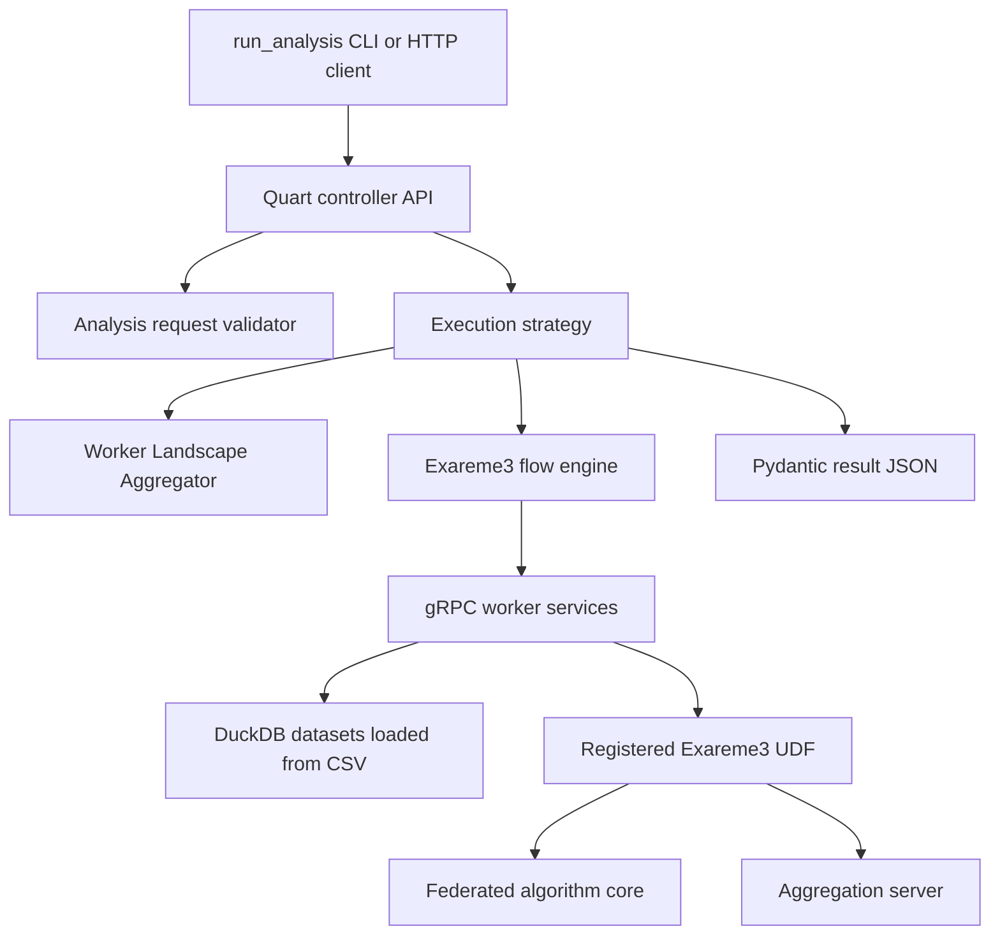

# Architecture

## Detected App Type

Exaflow is a Python backend/service repository with a monorepo-like nested
package. The root package runs a federated execution engine with controller,
worker, aggregation server, algorithm, testing, deployment, and documentation
subsystems. `exadata-validator` is a separate Python package for validating
data-model folders.

No frontend application was detected in this repository.

## High-Level Structure

## Request and Data Flow

1. Clients discover common source inputdata, preprocessing, and algorithm
   specifications through `GET /specifications/inputdata`,
   `GET /specifications/preprocessing`, and `GET /specifications/algorithms`.
   Metadata remains available through routes such as `/datasets`,
   `/datasets_variables`, and `/cdes_metadata`.
1. Clients submit `POST /analysis` with an `AnalysisRequestDTO` payload. The
   selected algorithm name is carried in `algorithm.name`.
1. `exaflow/controller/quart/endpoints.py` validates request shape and delegates
   to `validate_analysis_request`.
1. `get_algorithm_execution_strategy` selects an Exareme3 or Flower strategy.
1. Exareme3 strategy gets worker metadata, applies preprocessing metadata
   transforms, constructs `Exareme3AlgorithmFlowEngineInterface`, and runs the
   algorithm wrapper.
1. Algorithm wrappers under `exaflow/algorithms/exareme3` dispatch registered
   UDF calls to workers.
1. Workers load Arrow/Pandas data from DuckDB, apply worker-side preprocessing,
   enforce minimum-row privacy checks, and execute registered UDFs.
1. Optional aggregation-server-aware UDFs push partial values to the gRPC
   aggregation server and read combined results.
1. The algorithm returns a Pydantic model, serialized by the strategy as JSON.

## Module Boundaries

- Controller HTTP routing should stay in `exaflow/controller/quart`.
- Controller DTOs and request/spec validation should stay in
  `exaflow/controller/services/api`.
- Worker landscape aggregation and task orchestration should stay in
  `exaflow/controller/services`.
- Worker data loading, UDF execution, and DuckDB handling should stay in
  `exaflow/worker`.
- Runtime algorithm wrappers, preprocessing specs, and UDF registration should
  stay in `exaflow/algorithms/exareme3`.
- Testable algorithm math and reusable federated primitives should stay in
  `exaflow/algorithms/federated`.
- Deployment manifests should stay in `kubernetes` and Dockerfiles.
- Data-model folder validation should stay inside `exadata-validator`.

## Dependency Direction

The normal dependency direction is:

`controller API -> controller services -> worker clients -> worker gRPC service -> worker UDF service -> algorithm wrappers/core`.

Federated core modules should remain testable without a running controller or
worker deployment. Runtime wrappers can depend on controller/worker interfaces,
registries, and specifications.

## Persistence Layer

Workers load CSV datasets into DuckDB. Worker config resolves `data_path` and
DuckDB path through `exaflow/worker/__init__.py`, using
`EXAFLOW_WORKER_CONFIG_FILE` when set or bundled `config.toml` otherwise.

There is no traditional migration framework detected. Data fixtures live under
`tests/test_data`; prod validation data paths are generated by
`tests/worker_data_paths_builder.py`.

## API Layer

The Quart API exposes:

- `GET /specifications/inputdata`
- `GET /specifications/preprocessing`
- `GET /specifications/algorithms`
- `POST /analysis`
- `GET /datasets`
- `GET /datasets_locations`
- `GET /datasets_variables`
- `GET /cdes_metadata`
- `GET /data_models_attributes`
- `POST /wla`
- `GET /healthcheck`
- Flower routes: `GET /flower/input`, `POST /flower/result`

`documentation/api-specification.md` is the human-facing API contract. The
runtime source of truth for algorithm form shape remains the specification
endpoints.

## Background Jobs and Services

Controller startup calls `start_background_services()`, which maintains runtime
state such as worker landscape aggregation. Workers expose gRPC services and
load data at startup. The aggregation server keeps request-scoped aggregation
contexts until cleanup.

## External Services

- Worker gRPC services.
- Aggregation server gRPC service.
- Optional Flower components.
- Optional SMPC coordinator, queue, database, players, and clients configured by
  `tasks.py` and `.deployment.sample.toml`.
- Docker, Helm, and Kubernetes/kind for deployment and prod validation tests.
- CI publishing uses external registries and secrets.

## Config and Environment Model

- Controller reads `EXAFLOW_CONTROLLER_CONFIG_FILE` or bundled
  `exaflow/controller/config.toml`.
- Worker reads `EXAFLOW_WORKER_CONFIG_FILE` or bundled
  `exaflow/worker/config.toml`.
- Aggregation server reads `AGG_SERVER_CONFIG_FILE` or bundled
  `exaflow/aggregation_server/config.toml`.
- Algorithm discovery can be controlled by `EXAREME3_ALGORITHM_FOLDERS` and
  `FLOWER_ALGORITHM_FOLDERS`.
- Local deployment uses `.deployment.toml` and generated files under `configs/`.

## Known Gaps

- Static typecheck command is unknown.
- Full production deployment expectations outside the documented Helm/kind flows
  need verification.
- Some Flower and SMPC paths appear optional or partly disabled in CI; verify
  before broad changes.
